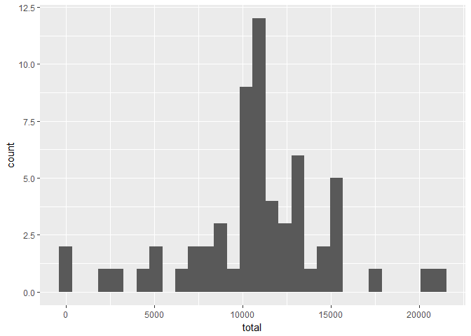

# Reproducible Research: Peer Assessment 1

## Loading library

```r
library(data.table)
library(dplyr,warn.conflicts = FALSE)
library(ggplot2)
library(lubridate,warn.conflicts = FALSE)
library(magrittr)
library(ggpubr)
```


## Loading and preprocessing the data

```r
dt<-fread(unzip("activity.zip"))
dt[,date:=ymd(date)]
```
## What is mean total number of steps taken per day?

```r
dtsum<-dt[,.(mean=mean(steps,na.rm = TRUE),median=as.double(median(steps,na.rm = TRUE)),total=sum(steps,na.rm = TRUE),maxinterval=interval[which.max(steps)]),by=date]
dtsum
```

```
##           date       mean median total maxinterval
##  1: 2012-10-01        NaN     NA     0          NA
##  2: 2012-10-02  0.4375000      0   126        2210
##  3: 2012-10-03 39.4166667      0 11352         620
##  4: 2012-10-04 42.0694444      0 12116        1815
##  5: 2012-10-05 46.1597222      0 13294        1210
##  6: 2012-10-06 53.5416667      0 15420        1840
##  7: 2012-10-07 38.2465278      0 11015        1710
##  8: 2012-10-08        NaN     NA     0          NA
##  9: 2012-10-09 44.4826389      0 12811         810
## 10: 2012-10-10 34.3750000      0  9900        1205
## 11: 2012-10-11 35.7777778      0 10304         825
## 12: 2012-10-12 60.3541667      0 17382         900
## 13: 2012-10-13 43.1458333      0 12426         850
## 14: 2012-10-14 52.4236111      0 15098        1035
## 15: 2012-10-15 35.2048611      0 10139         835
## 16: 2012-10-16 52.3750000      0 15084         815
## 17: 2012-10-17 46.7083333      0 13452         830
## 18: 2012-10-18 34.9166667      0 10056         815
## 19: 2012-10-19 41.0729167      0 11829        1825
## 20: 2012-10-20 36.0937500      0 10395        2025
## 21: 2012-10-21 30.6284722      0  8821        2020
## 22: 2012-10-22 46.7361111      0 13460        1140
## 23: 2012-10-23 30.9652778      0  8918        1200
## 24: 2012-10-24 29.0104167      0  8355        1900
## 25: 2012-10-25  8.6527778      0  2492        1950
## 26: 2012-10-26 23.5347222      0  6778         850
## 27: 2012-10-27 35.1354167      0 10119         915
## 28: 2012-10-28 39.7847222      0 11458         815
## 29: 2012-10-29 17.4236111      0  5018        2050
## 30: 2012-10-30 34.0937500      0  9819        1835
## 31: 2012-10-31 53.5208333      0 15414         730
## 32: 2012-11-01        NaN     NA     0          NA
## 33: 2012-11-02 36.8055556      0 10600         815
## 34: 2012-11-03 36.7048611      0 10571         925
## 35: 2012-11-04        NaN     NA     0          NA
## 36: 2012-11-05 36.2465278      0 10439         925
## 37: 2012-11-06 28.9375000      0  8334         750
## 38: 2012-11-07 44.7326389      0 12883         850
## 39: 2012-11-08 11.1770833      0  3219        1550
## 40: 2012-11-09        NaN     NA     0          NA
## 41: 2012-11-10        NaN     NA     0          NA
## 42: 2012-11-11 43.7777778      0 12608        1310
## 43: 2012-11-12 37.3784722      0 10765         855
## 44: 2012-11-13 25.4722222      0  7336        1215
## 45: 2012-11-14        NaN     NA     0          NA
## 46: 2012-11-15  0.1423611      0    41         325
## 47: 2012-11-16 18.8923611      0  5441        1025
## 48: 2012-11-17 49.7881944      0 14339        1710
## 49: 2012-11-18 52.4652778      0 15110        1635
## 50: 2012-11-19 30.6979167      0  8841         720
## 51: 2012-11-20 15.5277778      0  4472         855
## 52: 2012-11-21 44.3993056      0 12787         830
## 53: 2012-11-22 70.9270833      0 20427        1935
## 54: 2012-11-23 73.5902778      0 21194        1520
## 55: 2012-11-24 50.2708333      0 14478        1600
## 56: 2012-11-25 41.0902778      0 11834        1035
## 57: 2012-11-26 38.7569444      0 11162         550
## 58: 2012-11-27 47.3819444      0 13646         615
## 59: 2012-11-28 35.3576389      0 10183         610
## 60: 2012-11-29 24.4687500      0  7047         925
## 61: 2012-11-30        NaN     NA     0          NA
##           date       mean median total maxinterval
```

```r
qplot(x=total,data=dtsum,geom="histogram")
```

```
## `stat_bin()` using `bins = 30`. Pick better value with `binwidth`.
```

<!-- -->

mean and median of total number of steps taken per day are:

```r
dtsum[,c(mean(total),median(total))]
```

```
## [1]  9354.23 10395.00
```

## What is the average daily activity pattern?

```r
dtsumbyinterval<-dt[,.(mean=mean(steps,na.rm = TRUE)),by=interval]
qplot(x=interval,y=mean,data=dtsumbyinterval,geom="line")
```

<!-- -->

## What is the maximum number of steps interval?

```r
dtsumbyinterval[which.max(mean),interval]
```

```
## [1] 835
```

## Imputing missing values
Total number of NAs

```r
summary(dt)
```

```
##      steps             date               interval     
##  Min.   :  0.00   Min.   :2012-10-01   Min.   :   0.0  
##  1st Qu.:  0.00   1st Qu.:2012-10-16   1st Qu.: 588.8  
##  Median :  0.00   Median :2012-10-31   Median :1177.5  
##  Mean   : 37.38   Mean   :2012-10-31   Mean   :1177.5  
##  3rd Qu.: 12.00   3rd Qu.:2012-11-15   3rd Qu.:1766.2  
##  Max.   :806.00   Max.   :2012-11-30   Max.   :2355.0  
##  NA's   :2304
```

Missing value pattern

```r
dt[,.(N=.N,noNA=sum(is.na(steps))),by=date] 
```

```
##           date   N noNA
##  1: 2012-10-01 288  288
##  2: 2012-10-02 288    0
##  3: 2012-10-03 288    0
##  4: 2012-10-04 288    0
##  5: 2012-10-05 288    0
##  6: 2012-10-06 288    0
##  7: 2012-10-07 288    0
##  8: 2012-10-08 288  288
##  9: 2012-10-09 288    0
## 10: 2012-10-10 288    0
## 11: 2012-10-11 288    0
## 12: 2012-10-12 288    0
## 13: 2012-10-13 288    0
## 14: 2012-10-14 288    0
## 15: 2012-10-15 288    0
## 16: 2012-10-16 288    0
## 17: 2012-10-17 288    0
## 18: 2012-10-18 288    0
## 19: 2012-10-19 288    0
## 20: 2012-10-20 288    0
## 21: 2012-10-21 288    0
## 22: 2012-10-22 288    0
## 23: 2012-10-23 288    0
## 24: 2012-10-24 288    0
## 25: 2012-10-25 288    0
## 26: 2012-10-26 288    0
## 27: 2012-10-27 288    0
## 28: 2012-10-28 288    0
## 29: 2012-10-29 288    0
## 30: 2012-10-30 288    0
## 31: 2012-10-31 288    0
## 32: 2012-11-01 288  288
## 33: 2012-11-02 288    0
## 34: 2012-11-03 288    0
## 35: 2012-11-04 288  288
## 36: 2012-11-05 288    0
## 37: 2012-11-06 288    0
## 38: 2012-11-07 288    0
## 39: 2012-11-08 288    0
## 40: 2012-11-09 288  288
## 41: 2012-11-10 288  288
## 42: 2012-11-11 288    0
## 43: 2012-11-12 288    0
## 44: 2012-11-13 288    0
## 45: 2012-11-14 288  288
## 46: 2012-11-15 288    0
## 47: 2012-11-16 288    0
## 48: 2012-11-17 288    0
## 49: 2012-11-18 288    0
## 50: 2012-11-19 288    0
## 51: 2012-11-20 288    0
## 52: 2012-11-21 288    0
## 53: 2012-11-22 288    0
## 54: 2012-11-23 288    0
## 55: 2012-11-24 288    0
## 56: 2012-11-25 288    0
## 57: 2012-11-26 288    0
## 58: 2012-11-27 288    0
## 59: 2012-11-28 288    0
## 60: 2012-11-29 288    0
## 61: 2012-11-30 288  288
##           date   N noNA
```
 We can know NA is due to no record on particular day rather than random NA. So it is better to fill NA with mean of the 5 minutes interval

```r
dtimp<-dt
NAintervallist<-dtimp[is.na(steps),interval]
fillvalue<-sapply(NAintervallist,function(x){
  return(dtsumbyinterval[interval==x,mean])
})
class(dtimp$steps)<-"double"
dtimp[is.na(steps),steps:=fillvalue]

dtimpsum<-dtimp[,.(mean=mean(steps),median=as.double(median(steps,na.rm = TRUE))
                   ,total=sum(steps),maxinterval=interval[which.max(steps)]),by=date]
dtimpsumbyinterval<-dtimp[,.(mean=mean(steps)),by=interval]
```

After imputing all NAs, the histogram of total steps per day is as below:

```r
qplot(x=total,data=dtimpsum,geom="histogram")
```

```
## `stat_bin()` using `bins = 30`. Pick better value with `binwidth`.
```

<!-- -->

```r
print("mean and median of total number of steps taken per day are")
```

```
## [1] "mean and median of total number of steps taken per day are"
```

```r
dtimpsum[,c(mean(total),median(total))]
```

```
## [1] 10766.19 10766.19
```

The mean and median difference before and after imputing NAs are:

```r
dif<-dtimpsum[,c(mean(total),median(total))]-dtsum[,c(mean(total),median(total))]
dif
```

```
## [1] 1411.9592  371.1887
```

```r
if(dif>0){
  print("The result estimated total number of steps per day will increase")
  
}
```

```
## Warning in if (dif > 0) {: the condition has length > 1 and only the first
## element will be used
```

```
## [1] "The result estimated total number of steps per day will increase"
```

```r
if(dif<0){
  print("The result estimated total number of steps per day will decrease")
}
```

```
## Warning in if (dif < 0) {: the condition has length > 1 and only the first
## element will be used
```

```r
if(dif==0){
  print("The result estimated total number of steps has no change")
}
```

```
## Warning in if (dif == 0) {: the condition has length > 1 and only the first
## element will be used
```


## Are there differences in activity patterns between weekdays and weekends?

```r
dtimp[(wday(date)==1)|(wday(date)==7),weekend:="weekend"]
dtimp[!(wday(date)==1)|(wday(date)==7),weekend:="weekday"]
dtimpsumbyinterval<-dtimp[,.(mean=mean(steps)),by=c("interval","weekend")]
qplot(x=interval,y=mean,data=dtimpsumbyinterval,facets = (weekend~.),geom="line")
```

<!-- -->


